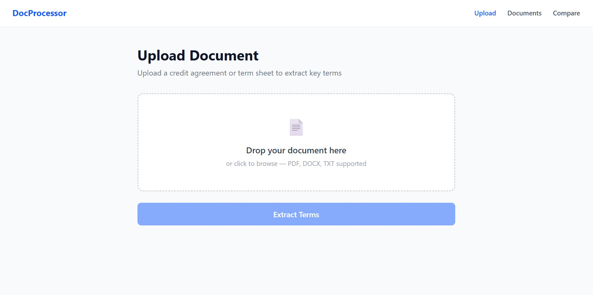

# DocProcessor

A financial document processing platform that extracts key terms from credit agreements and term sheets using an AI pipeline.


---

## What It Does

Upload a credit agreement or term sheet and DocProcessor automatically extracts structured financial terms into a clean two-column grid — no manual reading required.

- **Upload** PDF, DOCX, or TXT documents
- **Extract** key financial terms
- **Compare** two documents side by side with Match / No Match indicators
- **Export** results as CSV or formatted Excel
- **View** the source document inline alongside extracted terms

---

## Tech Stack

| Layer | Technology |
|---|---|
| Frontend | React + Vite + Tailwind CSS + React Router |
| Backend | FastAPI (Python) |
| Database | PostgreSQL (Supabase) |
| AI | Groq API — Llama 3.3 70B |
| File Processing | PyMuPDF (PDF), python-docx (DOCX) |
| Deployment | Vercel (frontend) + Render (backend) |

---

## Project Structure

```
doc-processor/
├── backend/
│   ├── main.py          → FastAPI endpoints
│   ├── extractor.py     → PDF/DOCX/TXT text extraction
│   ├── llm.py           → Groq API + regex pre-extraction pipeline
│   └── requirements.txt
└── frontend/
    ├── src/
    │   ├── pages/
    │   │   ├── Upload.jsx       → drag-drop upload with cancel
    │   │   ├── Documents.jsx    → document list
    │   │   ├── TermGrid.jsx     → extracted terms + export
    │   │   └── Compare.jsx      → side-by-side comparison
    │   └── components/
    │       └── Navbar.jsx
    └── vercel.json
```

---

## Running Locally

### Prerequisites
- Python 3.10+
- Node.js 18+
- PostgreSQL database (local or Supabase)
- Groq API key (free at [console.groq.com](https://console.groq.com))

### Backend Setup

```bash
cd backend
python -m venv venv
venv\Scripts\activate        # Windows
source venv/bin/activate     # Mac/Linux

pip install -r requirements.txt
```

Create `backend/.env`:
```
DB_HOST=your_db_host
DB_NAME=your_db_name
DB_USER=your_db_user
DB_PASSWORD=your_db_password
DB_PORT=5432
GROQ_API_KEY=...
```

Create database tables:
```sql
CREATE TABLE documents (
    id SERIAL PRIMARY KEY,
    filename VARCHAR(255) NOT NULL,
    file_type VARCHAR(10) NOT NULL,
    file_path VARCHAR(500),
    uploaded_at TIMESTAMP DEFAULT CURRENT_TIMESTAMP
);

CREATE TABLE terms (
    id SERIAL PRIMARY KEY,
    document_id INTEGER REFERENCES documents(id) ON DELETE CASCADE,
    term VARCHAR(255) NOT NULL,
    value TEXT NOT NULL
);
```

Start the backend:
```bash
uvicorn main:app --reload
```

### Frontend Setup

```bash
cd frontend
npm install
```

Create `frontend/.env`:
```
VITE_API_URL=http://localhost:8000
```

Start the frontend:
```bash
npm run dev
```

Open [http://localhost:5173](http://localhost:5173)

---

## API Endpoints

| Method | Endpoint | Description |
|---|---|---|
| POST | `/api/documents/upload` | Upload and process a document |
| GET | `/api/documents` | List all documents |
| GET | `/api/documents/{id}/terms` | Get extracted terms for a document |
| DELETE | `/api/documents/{id}` | Delete a document |
| GET | `/api/documents/{id}/export/excel` | Download formatted Excel export |
| GET | `/api/documents/{id}/file` | View source document inline |
| GET | `/api/documents/compare` | Compare two documents |
| POST | `/api/documents/cancel` | Cancel ongoing processing |

---

